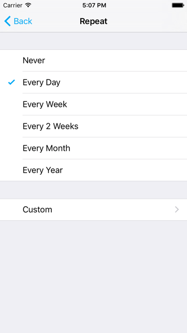
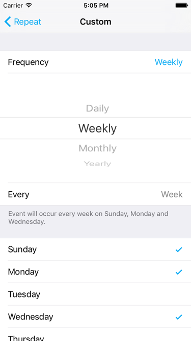
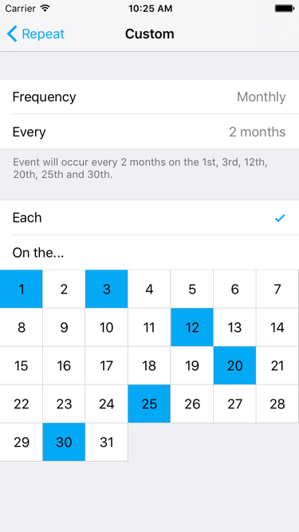

#TBRepeatPicker
TBRepeatPicker is an event repeat rule picker similar to iOS system calendar. You can easily apply it in your project and you'll be happy to do it!

 

 



##How To Get Started

### Podfile
```ruby
platform :ios, '8.0'
pod "TBRepeatPicker"
```

###Usage
##### 1. Create and present TBRepeatPicker
```objective-c
// init picker
let repeatPicker = TBRepeatPicker.initPicker(NSLocale.currentLocale(), language: .English, tintColor: UIColor.blueColor())

// assign a recurrence to the picker, you can pass nil or do nothing here when the repeat rule is "Never".
repeatPicker.recurrence = TBRecurrence.initMonthly(2, selectedMonthdays: [3, 17], locale: NSLocale.currentLocale())

// set delegate
repeatPicker.delegate = self

// push picker
navigationController?.pushViewController(repeatPicker, animated: true)
```
Note: You should always use push segue here to present the picker, TBRepeatPicker doesn't support other segues such as modal.

##### 2. Implement didPickRecurrence delegate
```objective-c
func didPickRecurrence(recurrence: TBRecurrence?) {
    // do something
}
```

## Minimum Requirement
 iOS 8.0

## Localization
TBRepeatPicker supports 5 languages: English, SimplifiedChinese, TraditionalChinese, Korean, Japanese. You can set the language when init.

## Swift and Objective-C
TBRepeatPicker support both Swift and Objective-C.

 in Objective-C, you just need to import a header like this:
```objective-c
#import "MyApp-Swift.h"
```

## Release Notes
* [Release Notes](https://github.com/hongxinhope/TBRepeatPicker/releases)

## License
Mantle is released under the MIT license. See [LICENSE](https://github.com/hongxinhope/TBRepeatPicker/blob/master/LICENSE.txt) for details.

## More Info
Have a question? Please [open an issue](https://github.com/hongxinhope/TBRepeatPicker/issues/new)!

